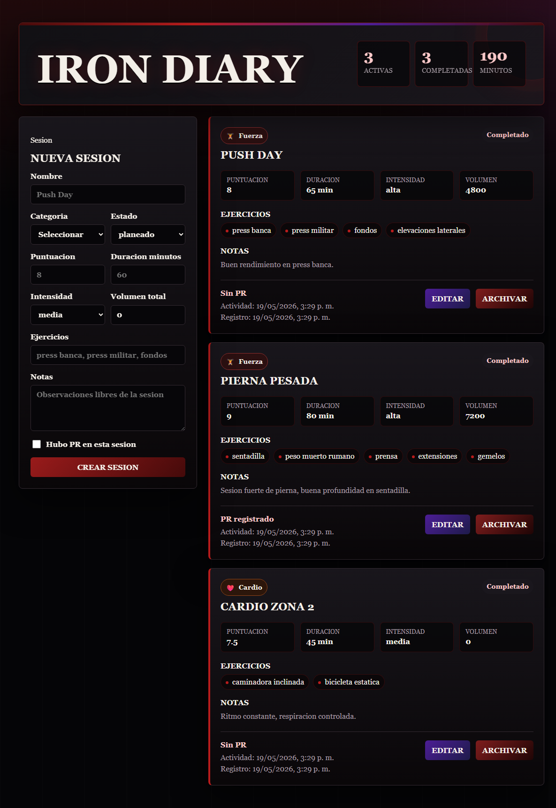

**App:** Iron Diary  
**Nombre:** Diego Guevara  
**Carnet:** 24128  
**Curso:** Sistemas y Tecnologias Web

Descripcion

Mi Bitacora de Entrenamiento es un proyecto para registrar sesiones de entrenamiento fisico. La aplicacion permite guardar entrenamientos con categoria, estado, puntuacion, duracion, intensidad, ejercicios, volumen total, notas y si hubo PR.

## Tema elegido

Entrenamiento fisico.

## Arquitectura de 3 entidades

 Entidad / Descripcion 

 Item /Sesion de entrenamiento. 
 Registro /Minutos de sesion asociados a un item. 
 Categorias / Fuerza, Cardio, Flexibilidad y Deportes. 

## Fase 1

En esta fase se entregan dos piezas funcionando de forma independiente:

- Frontend con React, Vite, useState, useEffect y LocalStorage.
- Backend con Node.js, Express, CORS, PostgreSQL y SQL crudo.

El frontend y el backend no estan conectados todavia.

## Tecnologias usadas

- React 18
- Vite
- JavaScript
- CSS puro con variables
- Node.js
- Express
- PostgreSQL
- pg
- cors
- dotenv

## Estructura de carpetas

```txt
fase1-mi-bitacora-entrenamiento/
├── frontend/
│   ├── src/
│   │   ├── components/
│   │   │   ├── FormularioItem.jsx
│   │   │   ├── ListaItems.jsx
│   │   │   └── ItemCard.jsx
│   │   ├── services/
│   │   │   └── localStorageService.js
│   │   ├── utils/
│   │   │   └── categorias.js
│   │   ├── App.jsx
│   │   ├── App.css
│   │   └── main.jsx
│   ├── package.json
│   └── index.html
├── backend/
│   ├── src/
│   │   ├── index.js
│   │   ├── routes/
│   │   │   └── items.js
│   │   └── db/
│   │       ├── index.js
│   │       └── schema.sql
│   ├── package.json
│   └── .env.example
├── docs/
│   └── mis-primeros-items.png
├── README.md
└── .gitignore
```

## Como correr el frontend

```bash
cd frontend
npm install
npm run dev
```

El frontend funciona con LocalStorage. No hace llamadas al backend en Fase 1.

## Como correr el backend

```bash
cd backend
npm install
copy .env.example .env
npm run dev
```

Antes de correrlo, se debe crear la base de datos en PostgreSQL.

## Como crear la base de datos en pgAdmin4

1. Abrir pgAdmin4.
2. Conectarse al servidor local de PostgreSQL.
3. Crear una base de datos nueva.
4. Nombre recomendado:

```txt
fase1_items
```

5. Editar `backend/.env` con los datos reales de la instalacion local.

El archivo `.env` no se sube al repositorio porque contiene datos privados.

## Variables de entorno

```txt
PORT=3000
FRONTEND_URL=http://localhost:5173
DB_HOST=localhost
DB_PORT=5432
DB_USER=postgres
DB_PASSWORD=tu_password
DB_NAME=fase1_items
```

## Endpoints

| Metodo | Ruta | Descripcion |
| --- | --- | --- |
| GET | `/api/health` | Verifica que la API funciona. |
| GET | `/api/items` | Devuelve todos los items activos. |
| GET | `/api/items/:id` | Devuelve un item por id. |
| POST | `/api/items` | Crea un item nuevo. |
| PUT | `/api/items/:id` | Actualiza un item existente. |
| DELETE | `/api/items/:id` | Archiva un item con `activo = 0`. |
| POST | `/api/items/:id/registro` | Crea un registro de minutos para un item. |

## Campos del item

| Campo | Tipo | Descripcion |
| --- | --- | --- |
| id | string | UUID del item. |
| nombre | string | Nombre de la sesion. |
| categoriaId | string | Categoria de entrenamiento. |
| estado | string | planeado, completado u omitido. |
| puntuacion | number/null | Puntuacion de 0 a 10. |
| fechaRegistro | string ISO | Fecha de creacion. |
| fechaActividad | string ISO | Fecha de ultima actividad. |
| notas | string | Observaciones libres. |
| atributos | object | Datos especificos de entrenamiento. |
| activo | boolean | Indica si se muestra en la lista activa. |

## Atributos del item

```js
{
  duracionMinutos: number,
  intensidad: "baja" | "media" | "alta",
  ejercicios: string[],
  volumenTotal: number,
  pr: boolean
}
```

## Campos del registro

| Campo | Tipo | Descripcion |
| --- | --- | --- |
| id | string | UUID del registro. |
| itemId | string | Id del item relacionado. |
| fecha | string ISO | Fecha del registro. |
| valor | number | Minutos de sesion. |
| notas | string | Observaciones del registro. |

## Mis primeros Items

La captura debe mostrar al menos 3 sesiones reales:

- Push Day
- Pierna pesada
- Cardio zona 2



## Decisiones tecnicas

- Se uso `useState` con lazy initializer para leer LocalStorage solo al montar el componente.
- Se uso `useEffect` para sincronizar LocalStorage cada vez que cambia la lista de items.
- El frontend no usa Axios ni librerias externas de estado.
- El backend usa Express con CORS configurado desde variables de entorno.
- La base de datos usa PostgreSQL con SQL crudo y `pg`.
- Los items no se borran fisicamente; se archivan cambiando `activo` a `0`.
- `atributos` se guarda como JSON serializado en PostgreSQL y se devuelve como objeto.

## Checklist de pruebas

### Frontend

```bash
cd frontend
npm install
npm run dev
```

- Crear 3 sesiones reales: Push Day, Pierna pesada y Cardio zona 2.
- Refrescar el navegador y confirmar que siguen guardadas.
- Editar una sesion.
- Archivar una sesion.
- Revisar LocalStorage en DevTools.

### Backend

```bash
cd backend
npm install
copy .env.example .env
npm run dev
```

Probar:

```txt
GET    http://localhost:3000/api/health
GET    http://localhost:3000/api/items
POST   http://localhost:3000/api/items
PUT    http://localhost:3000/api/items/:id
DELETE http://localhost:3000/api/items/:id
POST   http://localhost:3000/api/items/:id/registro
```

## Nota sobre Fase 2

En Fase 2 se conectara el frontend con el backend usando una arquitectura hibrida.
